# Azure App Services
This HOL will walk you thru the creation of an ASP.NET MVC App, SQL Database, ASP.NET Web API, Azure API App and finally an Azure Logic App.

The ASP.NET MVC leverages Entity Framework Code First Database Generation and Deployment to create and populate the seed data for the application. The application will be deployed to Azurewhich will be deployed to Azure as an Azure App Service web application.

The ASP.NET Web API will provide basic CRUD REST API services using the SQL Database created as part of the ASP.NET MVC application.  Once the application is completed you will publish it to Azure as an Azure Azure App Service Web application.

You will create and publish an Azure App Service API Application by using the completed ASP.NET Web Api application. Finally you will create an Azure Logic App that consumes the published Azure API app.

## Prerequisites
1. Azure subscription – we will be spinning up an a Web App, Web API, SQL Database. Although they are relatively inexpensive, make sure you have enough spend in your account to complete the walkthrough.
1. VSTS account – we will be using less than 10 build minutes, but you should make sure you have enough spend in your account to accommodate this.
1. Visual Studio 2015
2. [PowerShell Tools for Visual Studio](https://visualstudiogallery.msdn.microsoft.com/c9eb3ba8-0c59-4944-9a62-6eee37294597 "PowerShell Tools for Visual Studio")
3.  [Microsoft Azure SDK for .NET (VS 2015) 2.8.1](http://go.microsoft.com/fwlink/?linkid=699285&clcid=0x409 "Microsoft Azure SDK for .NET (VS 2015) 2.8.1")
## Initial Setup
The following steps must be completed prior to running through the following walkthrough.

###Create Azure Resource Group
1. In Internet Explorer or Edge, navigate to the Azure Portal - [https://portal.azure.com](https://manage.windowsazure.com/PublishSettings).\
2. **Click** on **Resource Groups**
3. In the **Resource Groups** Blade, **Click** on **Add**. In the **Resource Group** Blade. Enter a **Name** for the new **Resource Group** and validate the correct **Azure Subscription** is selected and **Resource group location**. 
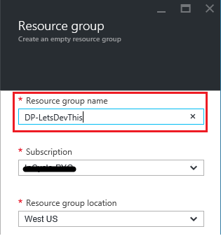
4. **Click** on the **Create** button. 
	> Rember name of the resource group as this will be used later in the exercise.
##Create ASP.NET Web Application
1. Open Visual Studio
2. From the **File** menu, click **New Project**.
3. 2.In the **New Project** dialog box, expand **C#** and select **Cloud** under **Installed Templates**, and then select **ASP.NET Web Application**.
4. **Name** the application **ContactManager**.
5. Make sure Add Application Insights to project is checked.  This will enable the ability to monitor and measure application performance.
6. Select the appropriate account and Azure Subscription which you established the Azure Resource Group.
7. Select "**New Application Insights resource**" option for the **Send Telemetry** list box.
8. Click **Configure Settings** directly beneath the Send Telemetry list box and select the Resource Group that you previously created and Click **OK**. 
 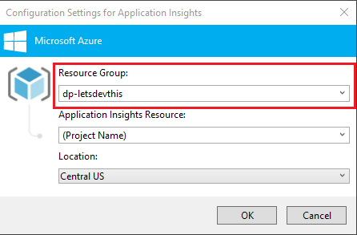
9. Click **OK**.
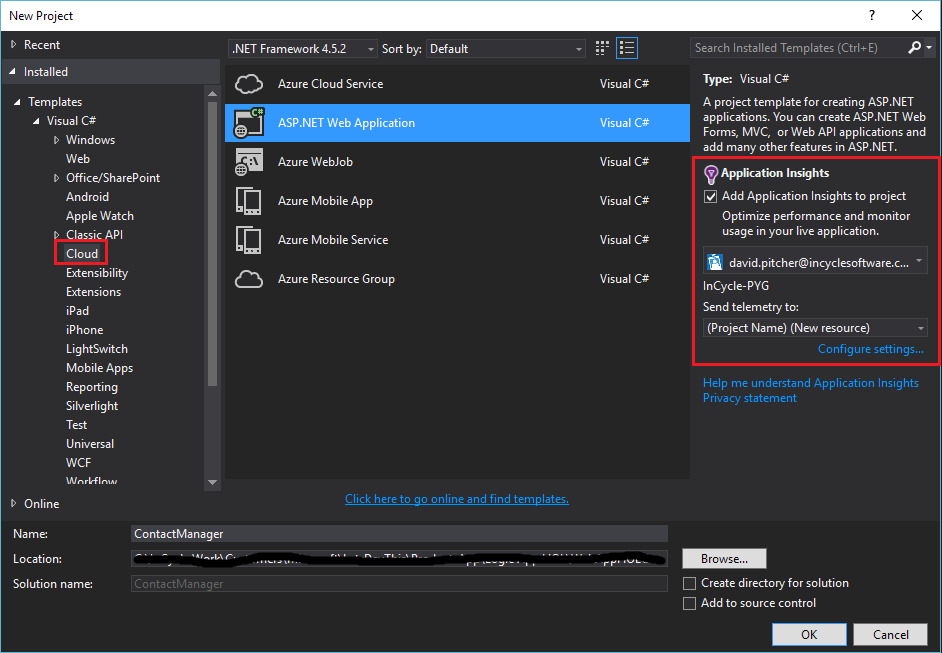
10. In the **New ASP.NET Project** dialog box, select the **MVC** template. Click the **Change Authentication** button  **Authentication** is set to **No Authentication**, click **OK**. Finally ensure **Host in the cloud** is checked, and **App Service** is selected.
11. Click **OK**. 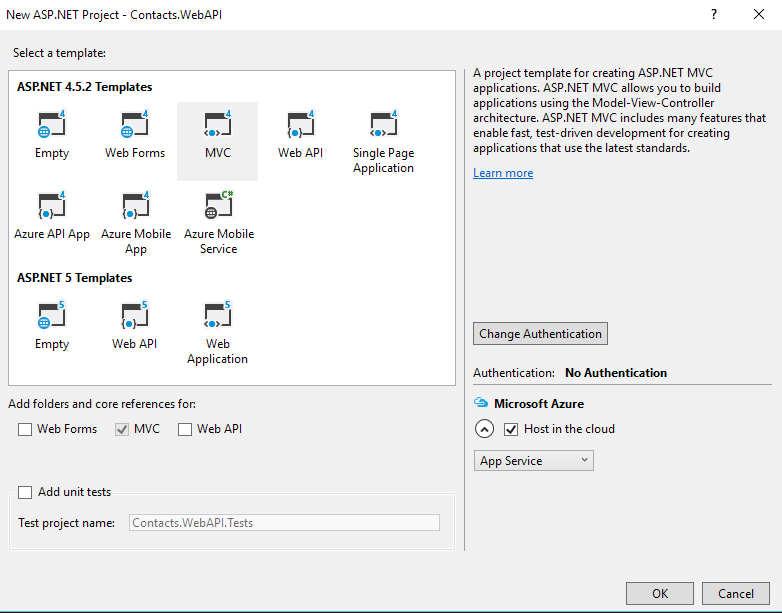
12. When the **Create App Service** dialog appears, make sure that you are signed in to Azure: sign in if you have not already done so, or reenter your credentials if your login is expired.
13. If you want to specify a name for your web app, change the value in the Web App name box. The URL of the web app will be {name}.azurewebsites.net, so the name has to be unique in the azurewebsites.net domain. The configuration wizard suggests a unique name by appending a number to the project name "ContactManager", and that's fine for this tutorial.
14. In the **Resource Group** drop-down select the resoure group that you created earlier.
15. Next to the **App Service Plan** drop-down. Click on the **New** button. Choose a **Location** that is near you or the location used for your Resource Group.  Select **S1** option in the **Size** drop down menu. Finally Click **OK**
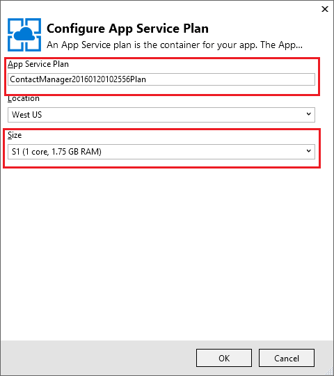
16. Don't click OK yet. In the next step, you'll configure the database resource. The dialog box now looks like the following illustration. 
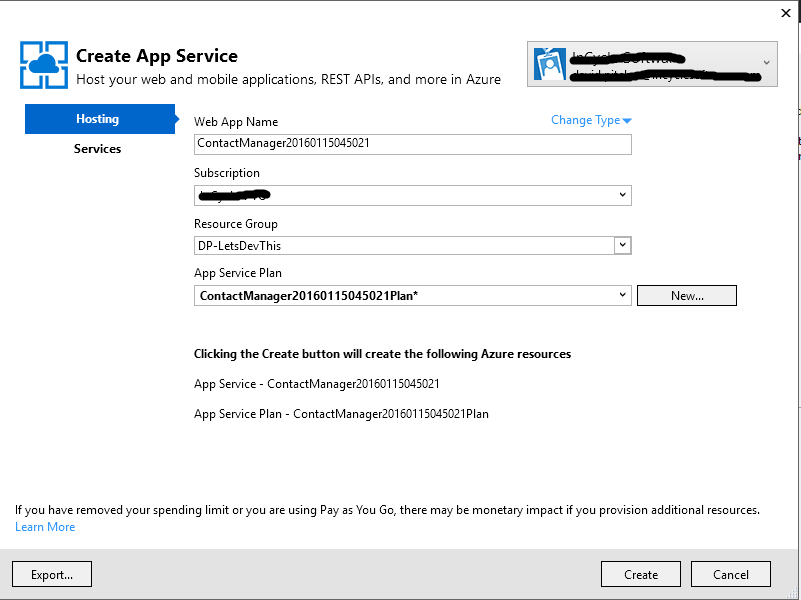
17. In the Create App Service dialog, click on **Services**, and then click on the **+** button to add a new Azure SQL Database.
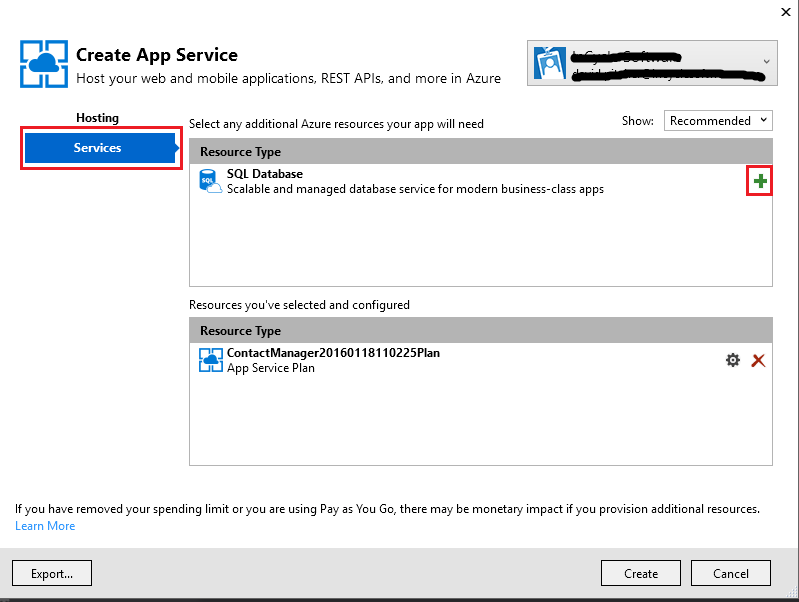
18. In the **Configure SQL Database** dialog, click on the **New** button next the the **SQL Server** text box to create a new Azure SQL Server Instance.
19. In the **Configure SQL Server** dialog, keep the default provided **Server Name** and enter a **Administrator Username** value of **demoadmin** and **Administrator Password** of **P2ssw0rd**, then click on the **OK** button. 
	> Note: Feel free to substitute your own value of Admin credentials.
20. Back in the **Configure SQL Database** dialog enter **ContactManager_db** for the **Database Name** and finally click the **OK** button.
21. The Create App Service dialog should not look like the following illustration.
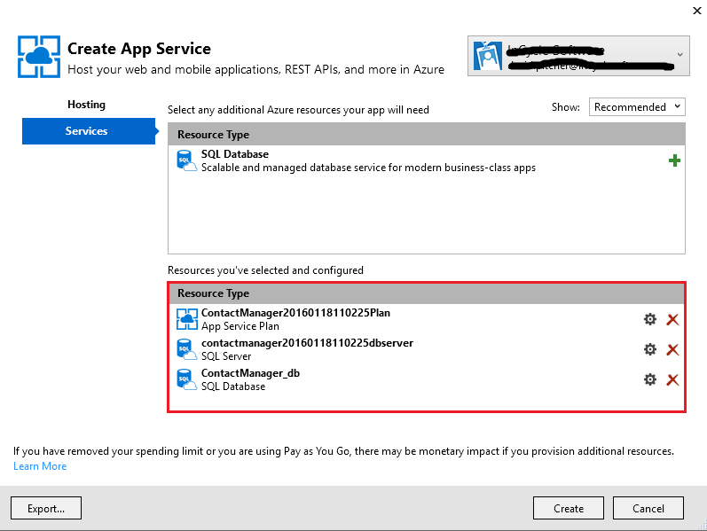
22. Click on the **Create** button to create the project.
	> Note: Visual Studio creates the ContactsManager project, create the SQL Server & Database you specified, creates App Service plan that you specified, and creates a web app in Azure App Service with the name you specified.
23. In the Visual Studio **Solution Explorer**, navigate to Contact Manager Project -> **Views** Folder -> **Shared** Folder and open** _Layout.cshtml**
24. Edit the `<title>` section to have the value of **`<title>@ViewBag.Title - Contact Manager</title>`**
25. Edit the existing `@Html.ActionLink("Application name", "Index", "Home", new { area = "" }, new { @class = "navbar-brand" })` to **`@Html.ActionLink("Contact Manager Demo", "Index", "Contacts", new { area = "" }, new { @class = "navbar-brand" })`**
26. Edit the `<footer>` section to have the value of **`
&copy; @DateTime.Now.Year - Contact Manager
`**
27. Right-Click on the **ContactManager** project and select **Set As StartUp Project**.
28. Press **CTRL-F5** to start the project to validate changes. Close the browser window to stop debugging after you have validated changes.
29. Right-Click on the **ContactManager** project and select **Publish** from the context menu.
30. In the **Publish Web** dialog, click on the **Validate Connection** button and then click on the **Publish** button to publish the project to Azure.
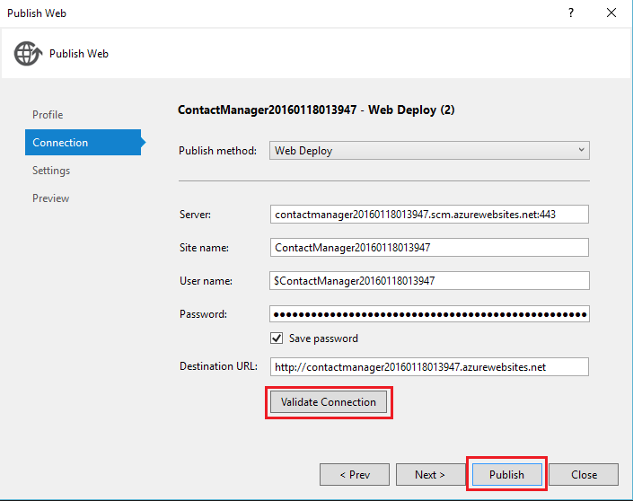
31. In **Solution Explorer,** right-click the **Models** folder in the **ContactManager** project, click **Add**, and then **Existing Item**.
32. Navigate to the HOL **Assets** Folder and select **Contact.cs** file, then click **Add**.
33. Build the **ContactManager** project.
34. In **Solution Explorer,** right-click the **Controllers** folder in the **ContactManager** project, click **Add**, and then **Controller**.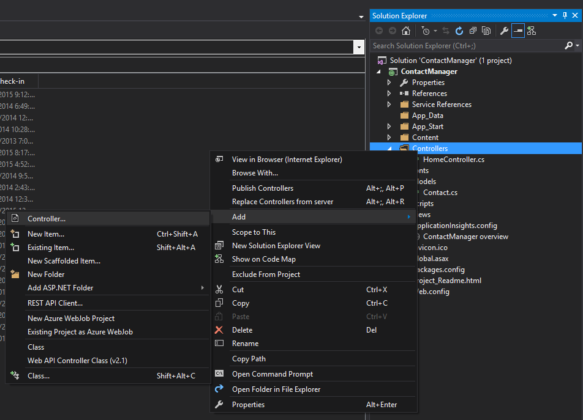
36. In the **Add Scaffold** dialog, select **MVC 5 Controller with views, using Entity Framework**. Click **Add**.

37. In the **Add Controller** dialog, do the following:
	1. In the Model class dropdown, select the **Contact** class. (If you don't see it listed in the dropdown, make sure that you built the project.) 
	2. Check **Use async controller actions**.
	3. Under **Views** make sure **Generate views**, **Reference script libraries**, and **Use a layout page** are **Checked**. 
	4. Leave the Layout page text box blank.
	5. Leave the controller name as ContactsController.
	6. Click plus (+) button next to Data Context Class.
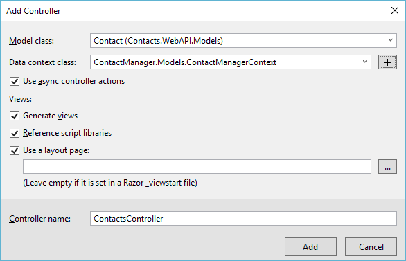
38. In the **New Data Context** dialog, leave the default value for the context type and click **Add**.
39. Click **Add** to complete the **Add Controller** dialog
40. From the **Tools** menu, select **Nuget Package Manager**, then select **Package Manager Console**. 
41. In the **Package Manager Console** window, set the **Package source** to **nuget.org**, set the **Default Project** to **ContactManager**and in the window enter the following command: **`Enable-Migrations`**
	>Note: This will add a Migrations folder and a Configuration.cs file to the project. Allow you to provide seed data for the Contact database. This demo is leveraging Entity Framework Code First Migrations.
42. In the **Package Manager Console** window enter the following command: **`add-migration Initial`**
	>Note: The add-migration Initial command generates a file named <date_stamp>Initial in the Migrations folder. The code in this file creates the database tables. The first parameter ( Initial ) is used to create the name of the file. You can see the new class files in Solution Explorer. In the Initial class, the Up method creates the Contacts table, and the Down method (used when you want to return to the previous state) drops it.

42. In the HOL **Assets** folder open the **ContactsSeedData.txt** file and **copy** the full contents of the file to the clipboard.
43. In **Solution Explorer** expand the **Migrations** folder in the **ContactManager** project and open the **Configuration.cs** file if not already open.
44. **Add** the following **using** statement: **`using Contacts.WebAPI.Models`**
44. Replace the commented code in the **Seed** method in the **Configuration.cs** file by pasting the contents of the **ContactsSeedData.txt** file and then Save Configuration.cs.
45. In the **Package Manager Console** window enter the following command: **`update-database`**
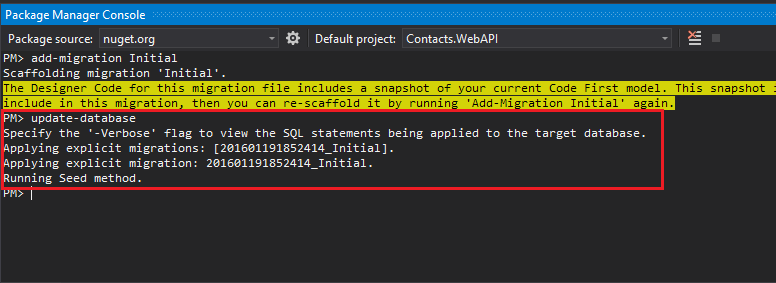
46. Press **CTRL-F5** to start the project. Click on the **Contact Manager Demo** link and validate a list of contacts is displayed. Close the browser window to stop debugging after you have validated the contact list.
47. Right-Click on the **ContactManager** project and select **Publish** from the context menu.
48. In the **Publish Web** dialog click on **Settings**. Expand **ContactManagerContext** under the **Databases** heading. Click on the drop down menu beneath **ContactsManagerContext** and select the **ContactManager_db** database.  Enable the **checkbox** for **Execute Code First Migration**.
49. Click the **Publish** button to publish the updated **ContactManager** project and create the database seed data.
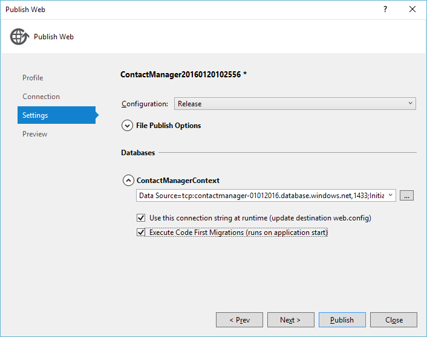
50. After the web site loads, click on the **Contact Manager Demo** link and validate a list of contacts is displayed. Close the browser window to after you have validated the contact list.
51. Open **Cloud Explorer** and expand SQL Database. Select the ContactManager_db and then select **Open SQL Server Object Explorer** to view the database tables and content.
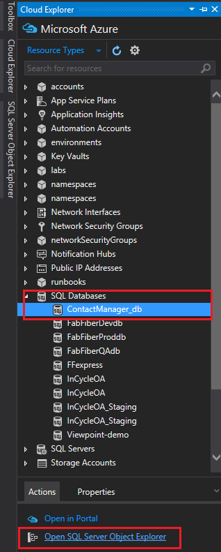

##Create Web API
1. Open Visual Studio
2. From the **File** menu, click **New Project**.
3. 2.In the **New Project** dialog box, expand **C#** and select **Cloud** under **Installed Templates**, and then select **ASP.NET Web Application**.
4. **Name** the application **Contacts.WebAPI**.
5. Make sure Add Application Insights to project is checked.  This will enable the ability to monitor and measure application performance.
6. Select the appropriate account and Azure Subscription which you established the Azure Resource Group.
7. Select "**New Application Insights resource**" option for the **Send Telemetry** list box.
8. Click **Configure Settings** directly beneath the Send Telemetry list box and select the Resource Group that you previously created and Click **OK**. 
 
9. Click **OK**.

10. In the **New ASP.NET Project** dialog box, select the **Web API** template. Click the **Change Authentication** button  **Authentication** is set to **No Authentication**, click **OK**. Finally ensure **Host in the cloud** is checked, and **App Service** is selected.
11. Click **OK**.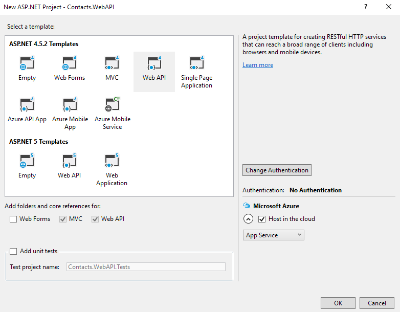
12. When the **Create App Service** dialog appears, make sure that you are signed in to Azure: sign in if you have not already done so, or reenter your credentials if your login is expired.
13. In the **Resource Group** drop-down select the resoure group that you created earlier.
14. With the **App Service Plan** drop-down select the App Service Plan you created for the **ContactManager** project.
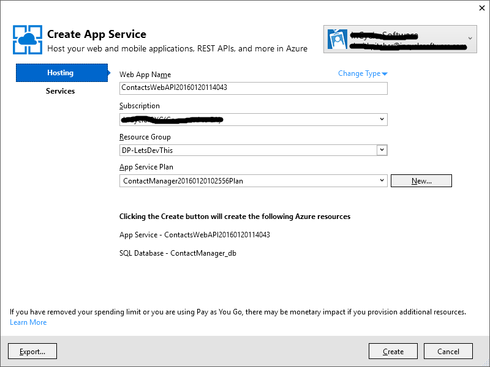
15. Click on the **Create** button to create the project.
16. In the Visual Studio **Solution Explorer**, navigate to **Contact.WebAPI** Project -> **Views** Folder -> **Shared** Folder and open** _Layout.cshtml**
17. Edit the `<title>` section to have the value of **`<title>@ViewBag.Title - Contact List</title>`**
18. Edit the existing `@Html.ActionLink("Application name", "Index", "Home", new { area = "" }, new { @class = "navbar-brand" })` to **`@Html.ActionLink("Contact List Demo", "Index", "Home", new { area = "" }, new { @class = "navbar-brand" })`**
19. Edit the `<footer>` section to have the value of **`
&copy; @DateTime.Now.Year - Contact List
`**
20. Right-Click on the **Contacts.WebAPI** project and select **Set As StartUp Project**.
21. Press **CTRL-F5** to start the project to validate changes. Close the browser window to stop debugging after you have validated changes.
22. Right-Click on the **Contact.WebAPI** project and select **Publish** from the context menu.
23. In the **Publish Web** dialog, click on the **Validate Connection** button and then click on the **Publish** button to publish the project to Azure.

24. In **Solution Explorer,** right-click the **Models** folder in the **Contacts.WebAPI** project, click **Add**, and then **New Item**.
25. Take note of the **name** of the database server that was created as part of the **ContactManager** project.  You will need this in the next few steps
26. In the **Add New Item** dialog select **ADO.NET Entity Data Model**.  This is found under Visual C# -> Data.  Enter the value of **Contacts** as the **Name** of the model and then click **Add**.
27. In the **Entity Data Model Wizard** select **EF Designer from database** and click **Next**

28. Click on **New Connection** to create a new connections string to your existing Azure SQL Database.
29. In the **Choose Data Source** dialog select **Microsoft SQL Server** as the Data Source. Leave the remaining options set at the default values and click **Continue**.
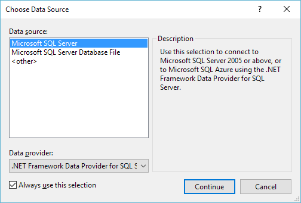
30. In the **Connection Properties** dialog enter the the fully qualified name of your Azure SQL Server.  Should in the format of servername.database.windows.net.  Select **Use SQL Server Authentication** and enter the appropriate login credentials, click on **Save my password**. Enter **ContanctManager_db** for the database name to connect to. Click on **Test Connection** to validate the database connection and finally Click on **OK**
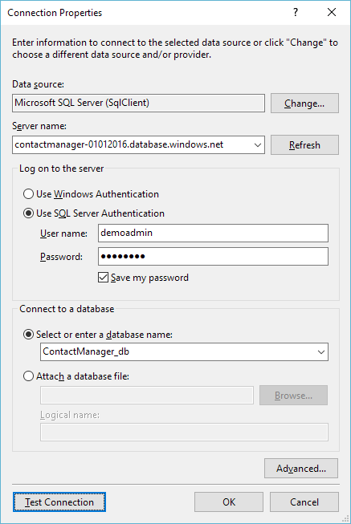
31.  Back in the **Entity Data Model Wizard** click on the **Yes** radion button to include sensitive data in the connection.  Which is okay for this demo and normally would not recommend.  Click on **Next**.
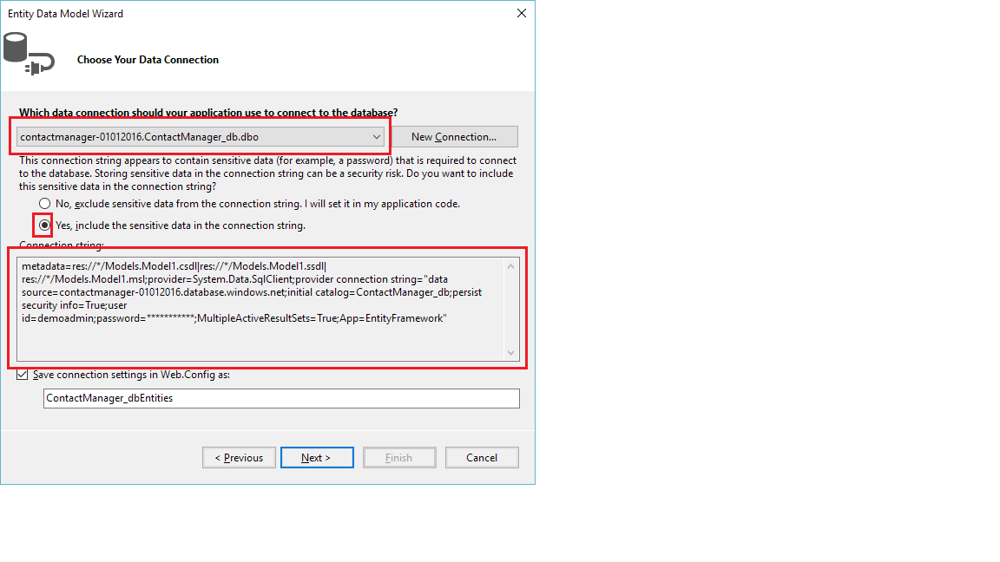
32. Select **Entity Framework 6.x** and click **Next**
33. Navigate the Tables tree and select **Contacts** as the object to include in the model. Leave all other options at their defaults and click **Finish**.
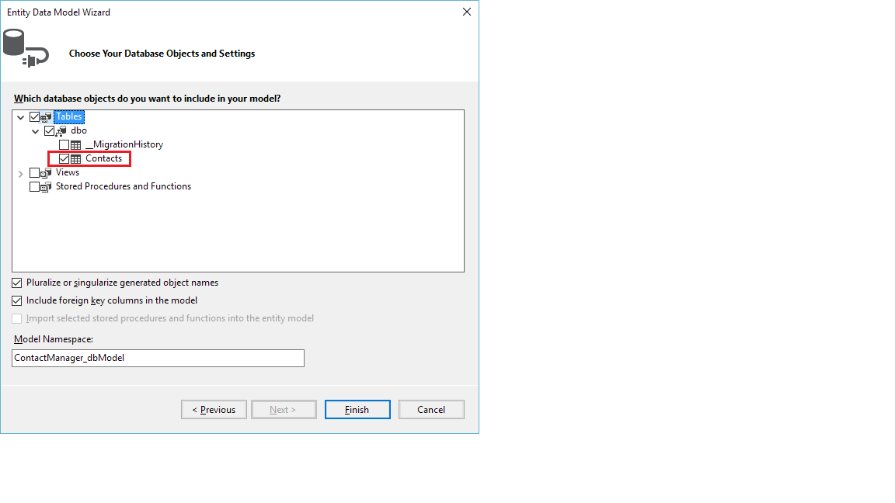
34. In **Solution Explorer,** expand the **Controllers** folder in the **Contacts.WebAPI** project, right-click on **ValuesController.cs**, and from the context menu click on **Delete**.
35. Build the **Contacts.WebAPI** project.
36. In **Solution Explorer,** right-click the **Controllers** folder in the **Contacts.WebAPI** project, click **Add**, and then **Controller**.
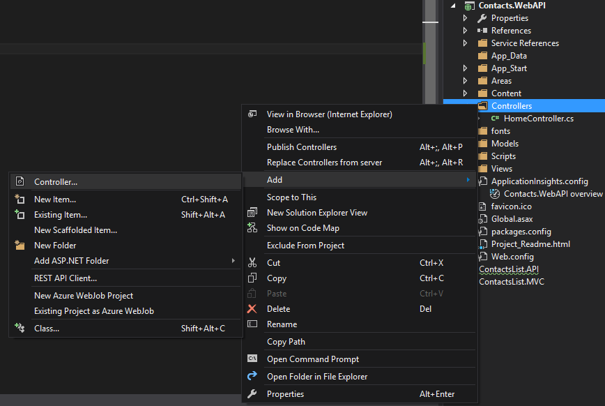
37. In the **Add Scaffold** dialog, select **Web API 2 Controller with actions, using Entity Framework**. Click **Add**.
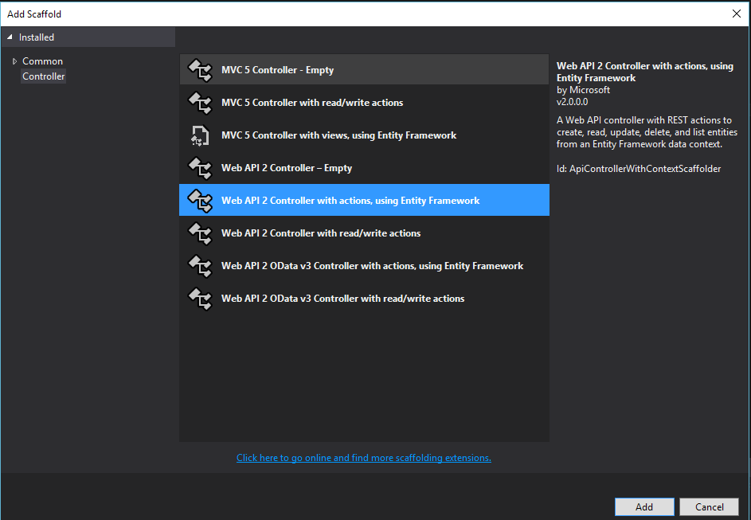
38. In the **Add Controller** dialog, do the following:
	1. In the Model class drop down, select the **Contact** class. (If you don't see it listed in the dropdown, make sure that you built the project.) 
	2. Select **ContactManager_dbEntities** as the **Data context class**.
	3. Check **Use async controller actions**. 
	4. Leave the controller name as **ContactsController**.	
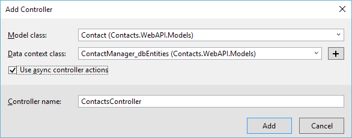
39. In the **New Data Context** dialog, leave the default value for the context type and click **Add**.
40. Click **Add** to complete the **Add Controller** dialog
41. Right-Click on the **Contact.WebAPI** project and select **Publish** from the context menu.
42. In the **Publish Web** dialog click on **Settings**. Expand **ContactManager_dbEntities** under the **Databases** heading. Click on the drop down menu beneath **ContactManager_dbEntities** and select the **ContactManager_db** database.  Do not check the checkbox for **Execute Code First Migration**.
43. Click the **Publish** button to publish the updated **Contacts.WebAPI** project.
44. In Internet Explorer after the site is published append **API/Contacts** the the site URL and validate a list of contacts is sent as a JSON response.

### Add Swagger Metadata to Contacts Web API
1. From the **Tools** menu, select **Nuget Package Manager**, then select **Package Manager Console**. 
2. In the **Package Manager Console** window, set the **Package source** to **nuget.org**, set the **Default Project** to **Contacts.WebAPI**and in the window enter the following command: **`Install-Package Swashbuckle`**
	>Note: This will ebable Swagger Metadata for the ASP.NET Web API application.
3. Press **CTRL-F5** to start the project to validate that Swagger in now enabled.
4. In your browser address bar, add swagger/docs/v1 to the end of the line, and then press **return**. (The URL will be something like http://localhost:51864/swagger/docs/v1).
	>This is the default URL used by Swashbuckle to return Swagger 2.0 JSON metadata for the API. 
5. If you're using Internet Explorer, the browser prompts you to download a v1.json file. If you are using Chrome or Edge the contents of the JSON file will be displayed in the browser window. Feel free to examine the content of the file.
6. Now try out the Swagger UI by removing the **docs/v1** from the browser's address bar, and then press **return**.  (The URL will be something like http://localhost:51864/swagger/). Explore the Swagger UI and close the browser window when complete.

### Create an Azure API App and Deploy Contacts.WebAPI to it
In this section you use Azure tools that are integrated into the Visual Studio Publish Web wizard to create a new API app in Azure. Then you deploy the ContactsList.API project to the new API app and call the API by running the Swagger UI again, this time while it runs in the cloud.

1. In **Solution Explorer**, right-click the **Contacts.WebAPI** project, and then click Publish.
2. In the **Profile** step of the **Publish Web wizard**, click **Microsoft Azure App Service**.
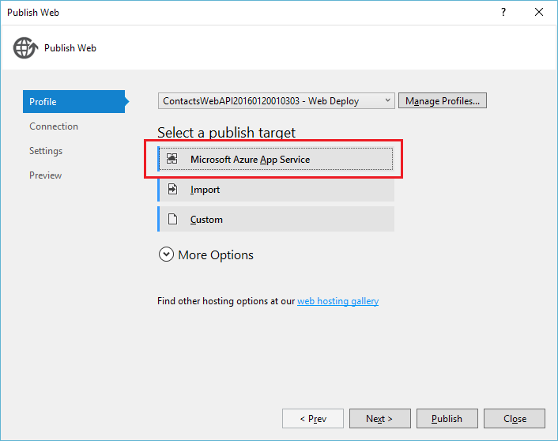
3. Sign in to your Azure account if you have not already done so, or refresh your credentials if they're expired.
4. In the **App Service** dialog box, choose the Azure Subscription you want to use, and then click **New**.
5. In the **Hosting** tab of the **Create App Service** dialog box, click **Change Type**, and then click **API App**. Change the **API App Name** to **ContactsAPI** plus some unique value to make the name unique in the **azurewebsites.net** domain. Change the **Resource Group** to the same resource groups used for the other exercises. Select the same **App Service Plan** used for the other exercises.
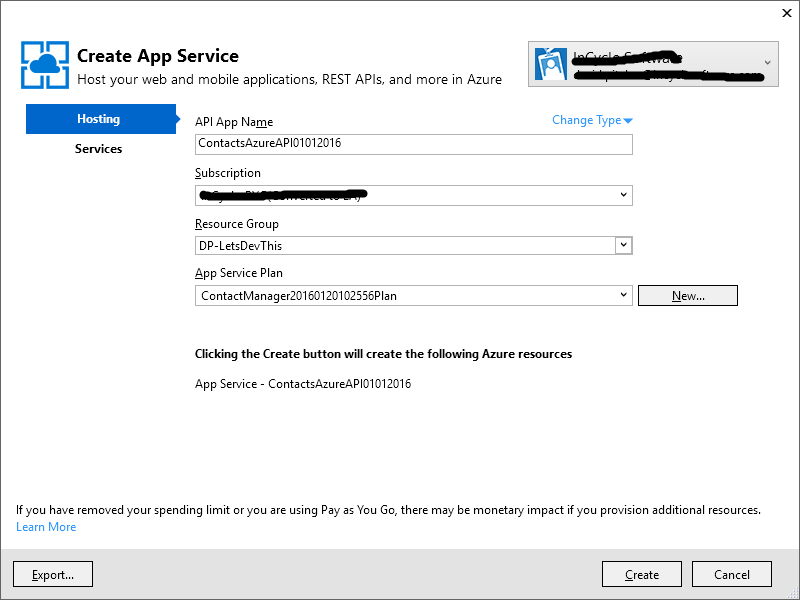
6. Click on **Create**
	>Note:Visual Studio creates the API app and creates a publish profile that has all of the required settings for the new API app. In the following steps you use the new publish profile to deploy the project. 
7. In the **Connection** tab of the **Publish Web wizard**, click **Publish**.
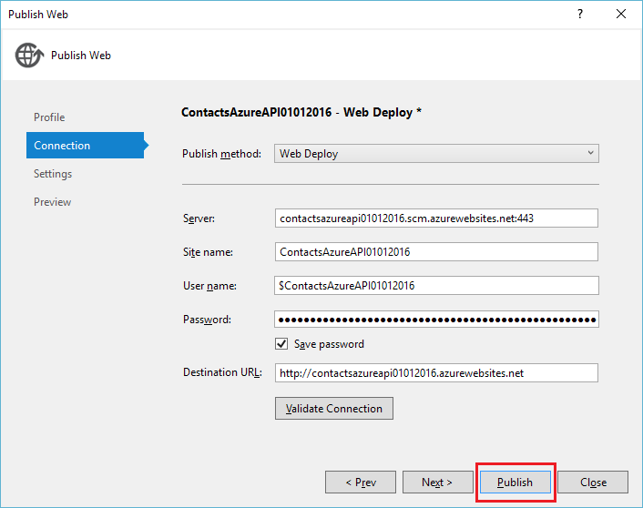
8. Add **swagger** to the URL in the browser's **address bar**, and then press **Enter**. (The URL will be http://{apiappname}.azurewebsites.net/swagger.)
	>Note:The browser displays the same Swagger UI that you saw earlier.
9. Open the [Azure Portal](https://portal.azure.com).  
10. Click on **Resource Groups**, then click on the **resource group** you created for this HOL, then click on your AzurePortalAPIApp.
11. In the **Settings** blade click on **API Definition**
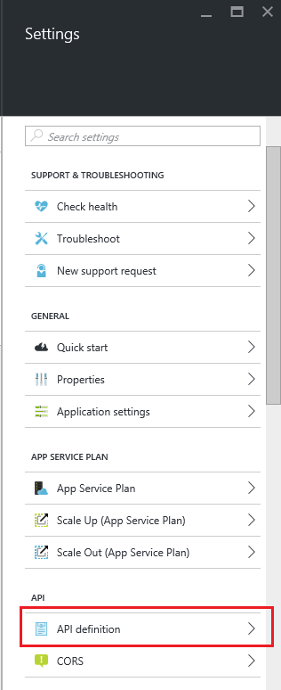
12. The API Definition blade lets you specify the URL that returns Swagger 2.0 metadata in JSON format. When Visual Studio creates the API app, it sets the API definition URL to the default value that you saw earlier, which is the API app's base URL plus /swagger/docs/v1. 
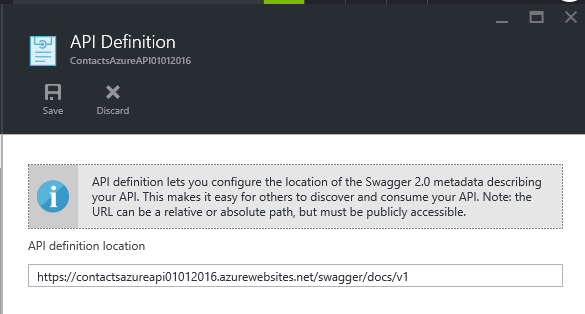

### Create an Azure Logic App that Consumes an Azure API App
1. Open the [Azure Portal](https://portal.azure.com).
2. click on **Resource Groups**, then click on the name of your resource group used for this HOL, then in the resource group blade click on **Resources** window, then in the **Resources** blade click on the **ContactAzureAPI** API App.
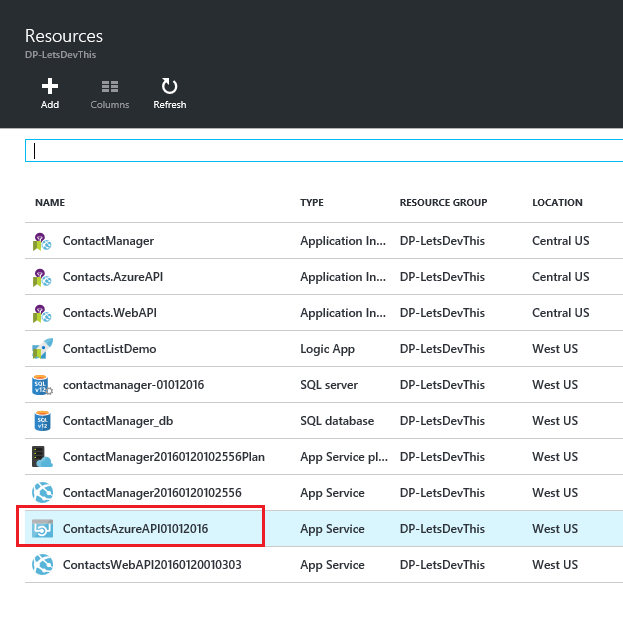
3. In the **API App** blade located the **Essentials** region and then the take note of the **URL**. You will need this when configuring the Logic App you are about to create.

4. Click on **New**, then in the **Marketplace** blade click on **Web + Mobile**, then in the **Web + Mobile** blade click on **Logic App**.
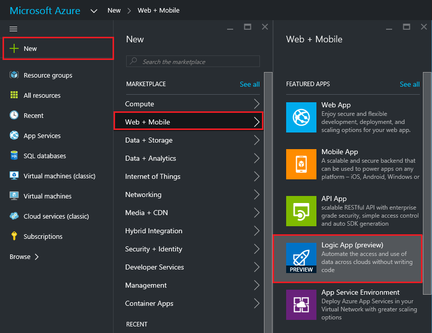
5. In the **Create logic app** blade, enter **ContactListDemo** for the **Name** field, for the **App Service Plan** click the **>** button and select the App Service Plan that has been used for this HOL, then click on **Create**.
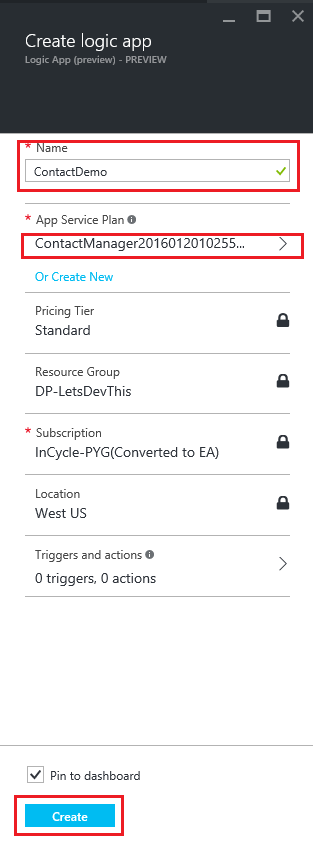
6. Wait for Azure to complete the creation of the Logic App. Once the Logic App is completed the **ContactListDemo** blade should be open.  If not you can click on **Resource Groups**, then click on the name of your resource group used for this HOL, then in the resource group blade click on **Resources** window, then in the **Resources** blade click on the **ContactListDemo** Logic App.
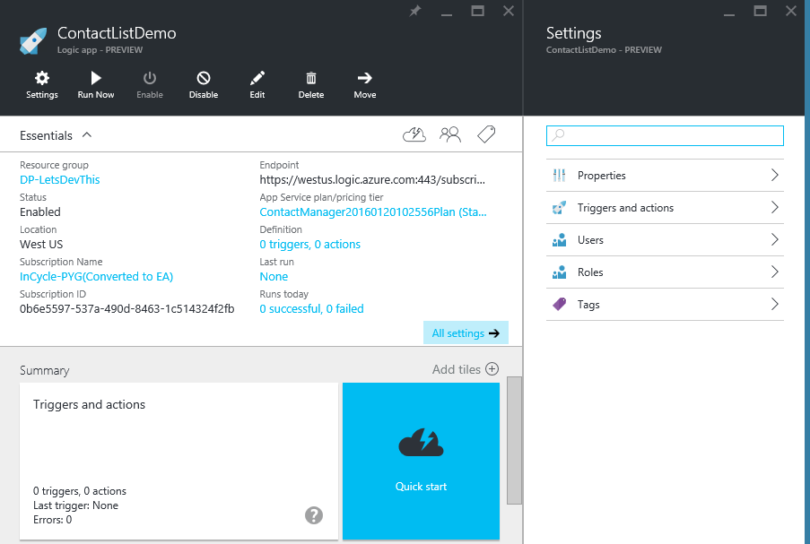
7.  In the **Settings** blade click on **Triggers and actions** to build out the Logic App.
8.  In the **Triggers and actions** blade click on the **Create from Scratch** Logic App Template.
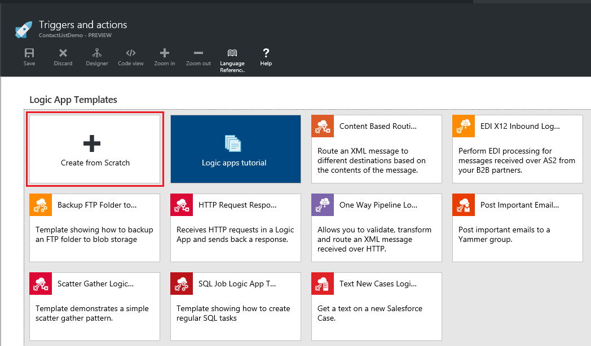
9. Now back in the **Triggers and actions** blade you should have a single tile titled **Start Logic**.  Click on the **Run this logic manually** check box.  
	>This forces the Logic App to run only when it is explicitly manually triggered. In a non-demo scenario you can add  **Recurrence** logic to schedule how often the Logic App is executed.
10. You should now have a new tile added titled **Add steps**

11. In the **Triggers and actions** blade on the far right side there is a window titled **APIs**.  This is where you will pick and choose the logic actions that are added your app.  You will want to locate and click on the **HTTP** action.
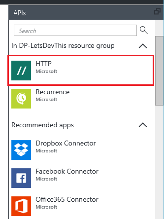
12. Now the **HTTP** action should be available and replaced the **Add steps** tile that was there previously.
13. On the **HTTP** action click on the **GET** action.  In the **UR** text box enter your Azure API App URL and then append **api/contacts** to the URL.  URL should be something like **http://contactsazureapi01012016.azurewebsites.net/api/contacts**. Tab away from the URI text box and all three fields should have a **Green** checkbox.  Finally click on the **Green** check mark to save the **GET** action configuration.
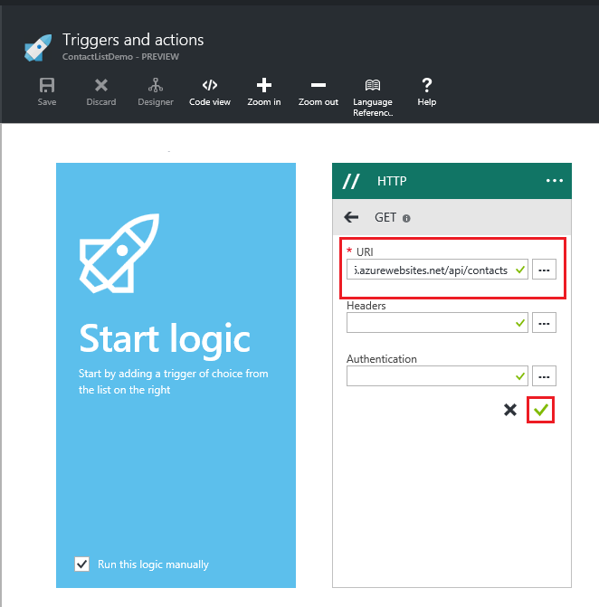
	> The HTTP GET action is now configured to make a Rest API call to your Azure API App. The URL we entered is to the retrieve a list of all contacts. This is a very simplistic demo of the capabilities of Logic App and connecting to an Azure API App.
14. Once you complete the **GET** action configuration, click on **Save** in the **Triggers and actions** blade. This will complete the creation of the Logic App.
15. Now click on the **ContactListDemo** blade navigation link to return back to the **ContactListDemo** blade.
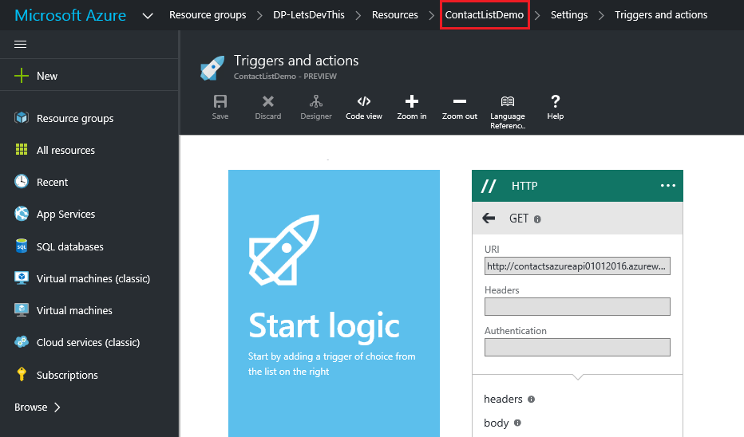
16. In the **ContactListDemo** Blade click on the **Run Now** button to start a single run of the Logic App.
17. After clicking on **Run Now** you will have a new run item listed in the **Operations** tile. Monitor this run until completed and the duration or the run is displayed and the **Arrow** icon turns **Green Check Mark**.
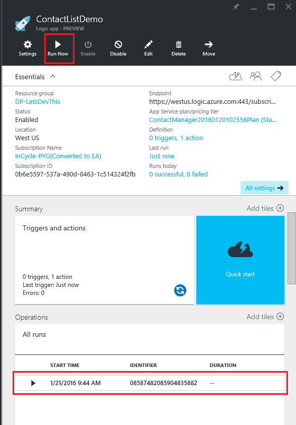
18. When the Logic App Run is complete, lets validate that it was successful in calling your API for contacts.  Click on the the specific run that you were monitoring in the previous step.  This will open that run in the **Logic app run** blade and give you details about the run.
19. Locate the Action step and click on it.
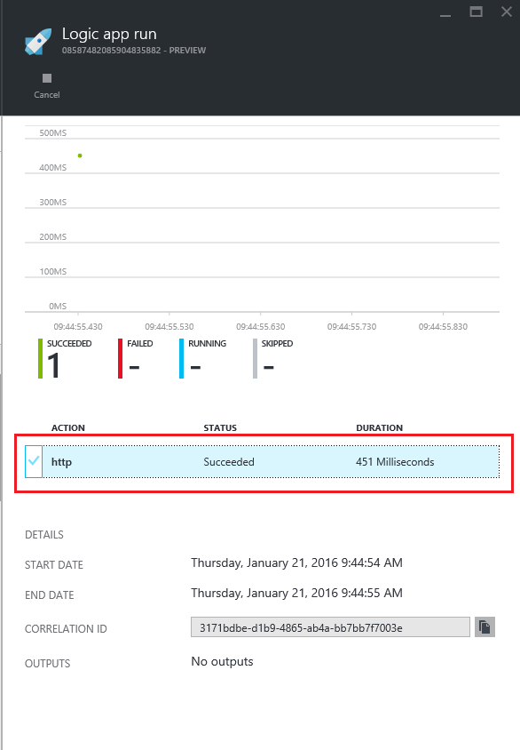
20. The **Logic app action** blade should now be visible.  This will give you details about the action.  Of importance is the **INPUTS LINK** and **OUTPUTS LINK**.  Click on the URL for the **OUTPUTS LINK**.
21. This will open the **Outputs** blade and contain the JSON formatted contents of the API App's response to the Contacts call.
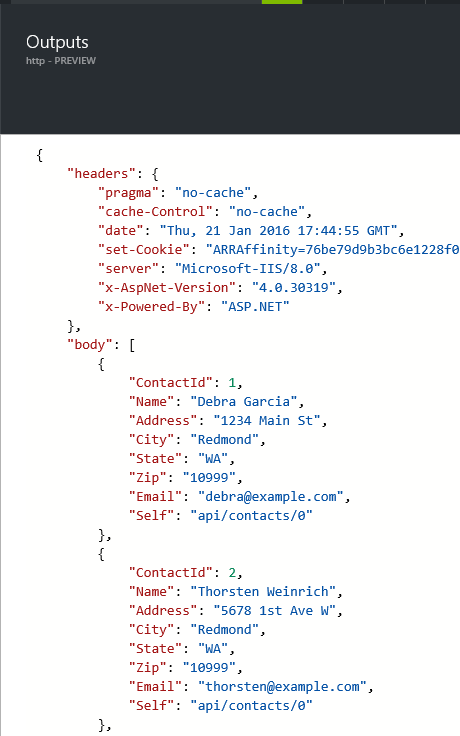

## Next Steps
Continue on exploring Azure App Services by adding a mobile app, extend the Logic app, add VSTS Build automation, Release Management and more.

### Link Azure Subscription in VSTS
This exercise walks you thru the steps necessary to link you Azure Subscription to VSTS to support build automation and deployment tasks.

1. In Internet Explorer or Edge, navigate to the Azure Management Portal to download your subscription PublishSettings file [https://manage.windowsazure.com/PublishSettings](https://manage.windowsazure.com/PublishSettings).
	> **Note: You may be prompted to login to first.

2. Click on Save to download the PublishSettings and take note of the location to where you save the file.
3. Open the PublishSettings file in Notepad or your favorite text editor, keep this handy as you will need to reference it later.
4. In Internet Explorer or Edge, open a new tab and navigate to your VSTS instance (e.g. https://myvsts.visualstudio.com)
5. Navigate to an existing Team Project that you will use for this HOL, this includes source code and build resources.
6. In the upper-right of the page, click the Administer Account (gear icon) button.
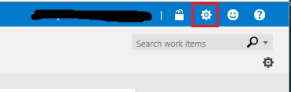
7. Click the Services tab.
8. In the left-hand navigation pane, click the New Service Endpoint button, and select Azure.
9. In the ADD NEW AZURE CONNECTION dialog click on the radio button labeled "Certificate Based".
10. In the "Connection Name" text box enter a descriptive name for the Azure Endpoint Connection, something like "Azure Service Connection".
11. Back in Notepad select and copy the Subscription **Id** without the quotes and paste into the Subscription Id text field in the ADD NEW AZURE CONNECTION dialog box.
12. Back in Notepad select and copy the Subscription **Name** without the quotes and paste into the Subscription Name text field in the ADD NEW AZURE CONNECTION dialog box.
12. Back in Notepad select and copy the Subscription **ManagementCertificate** without the quotes and paste into the Management Certificate text field in the ADD NEW AZURE CONNECTION dialog box.
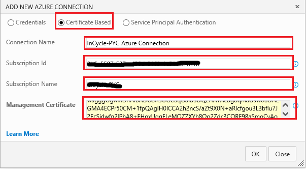
13. Click the OK button.
15. Close the browser tab. 
### Create VSTS Builds to build / deploy the projects