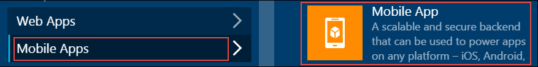
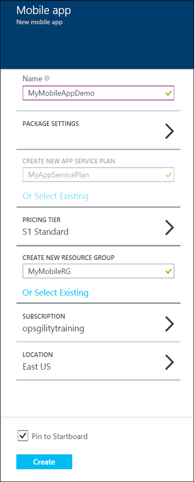
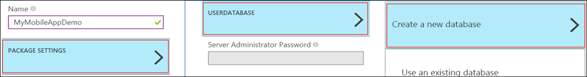
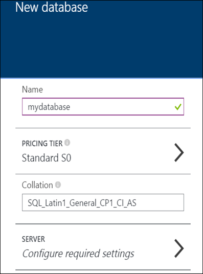
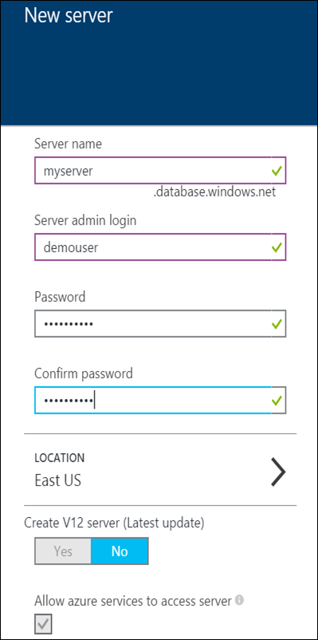
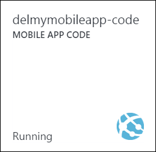
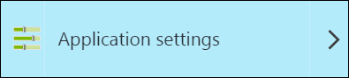
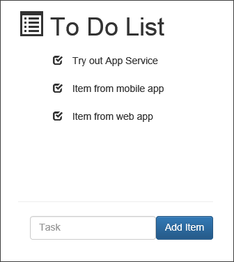

Create an app with a mobile and web client in Azure App Service
=======================================================================================
Mobile Apps in Azure App Service offer a highly scalable, globally available mobile application development platform for Enterprise Developers and System Integrators that brings a rich set of capabilities to mobile apps.

Mobile Apps help you build native and cross platform apps, connect to your enterprise systems, connect to SaaS APIs easily, build offline-ready apps with sync and push Notifications to millions in seconds.

In this lab, you will learn how to build a todo list web client using a Azure App Service Mobile App SQL Database backend. The task items will be stored in Azure SQL Database. 

This lab includes the following tasks:

* [Create a App Service Mobile App backend](#create-a-app-service-mobile-app-backend)
* [Publish a TodoList Web Api](#publish-a-todoList-web-api)
* [Publish a TodoList web client UI](#publish-a-todoList-web-client-ui)
* [Test the Mobile and Web Apps](#publish-a-todoList-web-client-ui)

## Create a App Service Mobile App backend

In this section, you will create a Azure App Service Mobile App backend. 

1. Log into the [Azure Portal](https://portal.azure.com/). In the top left the window, click **+NEW**. 

   

   This displays the **New Mobile App** blade.

2. Click **Mobile Apps** and then click **Mobile App**.

   

3. Enter **Name**. Create or select **APP SERVICE PLAN**. Select **PRICING TIER**. Create **RESOURCE GROUP**. Select **SUBSCRIPTION** and **LOCATION**.

   

4. Click **PACKAGE SETTINGS**. Click **USERDATABASSE** and then click **Create a new database**. 

   

5. Enter **Name** and select **Pricing Tier**.

   

6. Click **SERVER**.

   

7. Enter **Server name**, **Server admin login**, **Password** and select same **LOCATION** as the one selected earlier. 

  

8. Click **OK** three times and then click **Create**.

## Publish a TodoList Web Api

In this section, you will create a new web app using a sample Web Application solution using Visual Studio. You will modify the sample to use the same database schema name and the same connection string as the mobile app.

1. In the [Azure Portal](https://portal.azure.com/), create a new web app, using the same Resource Group and Hosting Plan as your mobile app.

2. Navigate to HOL\build-mobile-app-with-web-client\source\MultiChannelToDo DevCamp folder. Click **MultiChannelToDo** solution and open it in Visual Studio. 

3. In the Web API project, edit MultiChannelToDoContext.cs. In `OnModelCreating`, update the schema name to be the same as your mobile app name:

        modelBuilder.HasDefaultSchema("your_mobile_app"); // your service name, replacing dashes with underscore

4. Click **MOBILE APP CODE** tile from the "Mobile App" blade.

   

5. Click **All Settings**.

   

6. Click **Application Settings**. 

   

7. Under **Connection Strings** click **Show Connection Strings**. Copy the value for the setting **MS_TableConnectionString**. 

8. In Visual Studio, right click the Web API project and select **Publish**. Select **Azure Web Apps** as the publish target, and select the web app you created above. Click **Next** until you get to the **Settings** section of the Publish Web wizard.

9. In the **Databases** section, paste the mobile app connection string as the value for **MultiChannelToDoContext**. Select only the checkbox **Use this connection string at runtime**.

10. Once your Web API has been successfully published to Azure, you will see a confirmation page. Copy the URL for your published service.

## Publish a TodoList Web Client UI

In this section, you will use a sample web client application implemented with AngularJS. You will then use Visual Studio to publish the project to a new hosted App Service web app in Azure. 

1. In Visual Studio, open the project **MultiChannelToDo.Web**. Edit the file `js/service/ToDoService.js`, adding the URL to the Web API you just published:

        var apiPath = "https://your-web-api-site-name.azurewebsites.net";

2. Right click the project **MultiChannelToDo.Web** and select **Publish**.

3. In the **Publish Web** wizard, select **Azure Web App** as the publish target and create a new web app without a database. 

4. Once your project has been sucessfully published, you will see the web UI in your browser.

## Test the Mobile and Web Apps 

1. In the web UI, add or edit some todo items.

   

##Summary

By completing this lab you have learned how to:

* Create Azure App Service Mobile App backend
* Use the same underlying Mobile App backend for an app that has both a website and a mobile client

