Creating Logic App Instance
=======================================================================================

Logic Apps are part of a single integrated offering from Microsoft called the App Services which brings together best application building capabilities inside of Microsoft Azure. Logic Apps democratizes building complex integration process for users, IT Pros and developers alike. It empowers users automate business processes and integrate disparate data sources at cloud scale within rich system of enterprise-grade built-in connectors. Integrating between SaaS apps, on-premises backend services and custom APIs can now be done in a consistent, durable and reliable manner in the cloud.

This lab includes the following tasks:

* [Create a Customer database](#create-database)
* [Create an instance of an API App](#create-api-app)
* [Create an instance of a Logic App](#create-logic-app)
* [Test the Logic App](#test-logic-app)

## Create a Customer Database

In this task you will create a database to store customer records.

1. Visit Azure Preview Portal http://portal.azure.com and login with your Microsoft Azure credentials.

2. Click on **New** button from the upper left corner.
    
    

3. Click **Data + Storage** and then **SQL Database**.

     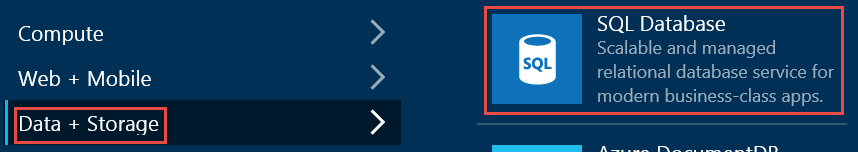

4. Enter a database **Name**, fill in required information in the tiles and then click **Create**. Be sure to note down database login information.
        
    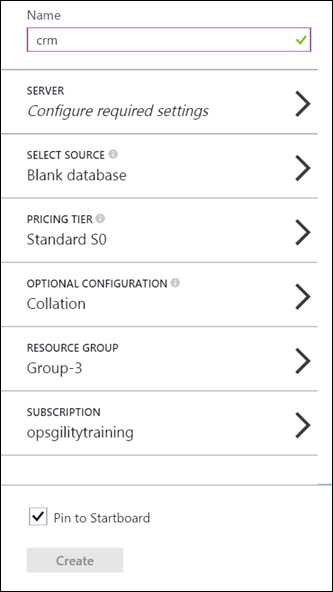

5. Click "Open in Visual Studio" button from the toolbar at the top.

    

6. Click on **Configure your firewall**.

    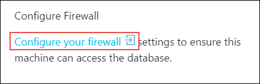

7. Make a note of **Client IP Address**.

    

8. Enter **Rule1** in the **Rule Name** text box. Add the IP address noted earlier in the **STARTUP IP** and **END AIP** text boxes. Click **Save** button in the toolbar from the top.

    

9. Click **Open in Visual Studio** in the **Open in Visual Studio** blade.

    

10. Click **Allow**.

    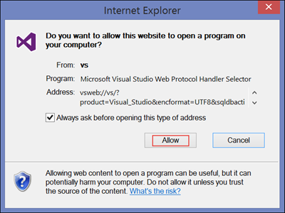
    
11. Enter database credentials you created earlier.

    

12. Open a **New Query**.

    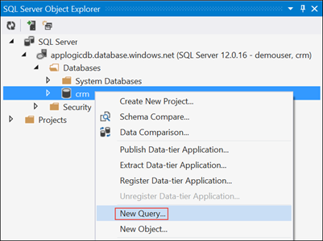
 
13. Paste the following statement and click **Execute** button   to create a Customer table.

        CREATE TABLE [dbo].[Customer] (
            [CustomerID] INT IDENTITY (1, 1) NOT NULL,
            [LastName]   VARCHAR (255) NULL,
            [FirstName]  VARCHAR (255) NULL,
            [Phone]      VARCHAR (50) NULL,
            [Address]    VARCHAR (255) NULL,
            [City]       VARCHAR (50) NULL,
            [Processed]  VARCHAR (50)  NULL,
            CONSTRAINT [PK_Customer] PRIMARY KEY CLUSTERED ([CustomerID] ASC)
        );

## Create an instance of an API App

In this task you will create an instance of SQL Connector Api App to access Customer data.

1. Visit.

2. Click **Home** from the top left navigaton bar.

    

3. Click **Marketplace**.

    

3. Enter **SQL Connector** in the search box and press **Enter**.

    

4. Click **Microsoft SQL Connector**.

    

5. Click **Create**.

	

6. Enter the following values in the **Microsoft SQL Connector** blade.
    <table class="tableizer-table">
        <tr><td>Name:</td><td>MicrosoftSqlConnectorCRM</td></tr>
        <tr><td>App Service Name:</td><td>MyAppServicePlan</td></tr>
        <tr><td>Resource Group:</td><td>MyApiRG </td></tr>
    </table>
    
    
    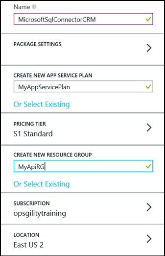
      
7. Click **PACKAGE SETTINGS**. Enter the fully qualified domain name for **Server Name**, **User Name**, **Password** and the following values.

    <table class="tableizer-table">
         <tr><td>Database Name:</td><td>crm</td></tr>
        <tr><td>Tables:</td><td>Customer</td></tr>
        <tr><td>Data Available Query:</td><td>select count(*) from Customer where Processed = 'false'</td></tr>
        <tr><td>Poll Data Query:</td><td>select * from Customer where Processed = 'false';UPDATE Customer SET Processed='true' WHERE Processed='false'</td></tr>
    </table>
    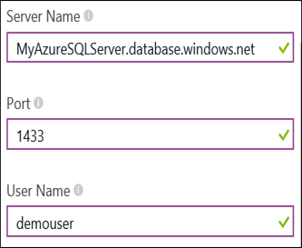  
   
    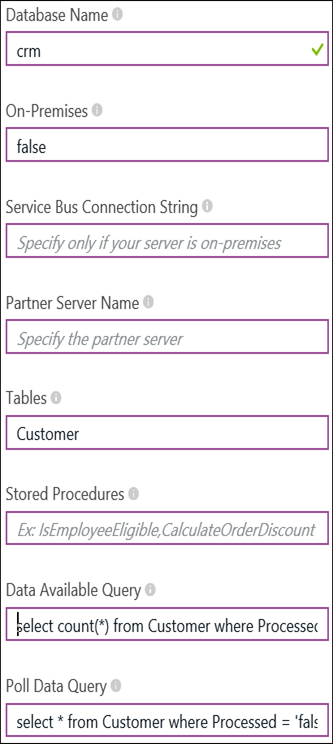
    

8. Click **OK**. Click **Create**.

3. Click **Add**.

## Create a instance of a Logic App

In this task you will create a Logic App to receive a text message whenever a customer data is created in the CRM database.

1. Click on **New** button from the upper left corner.
    
    

2. Clicl **Web + Mobile** and then click **Logic App**.

    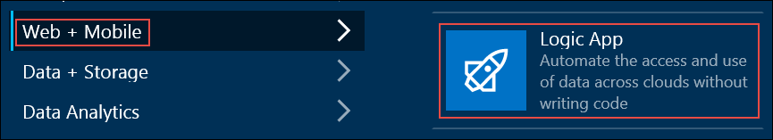

3. Enter a **Name**, select the **APP SERVICE PLAN** created previously and then click **Create** button.

    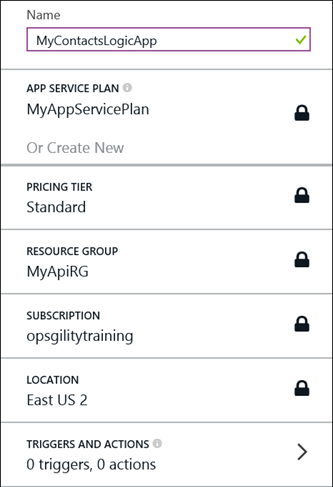

4.  Click **Triggers and actions** in the **Summary** tile.

    

5.  Click **Microsoft SQL Connector** listed the **API Apps** pane under the resource group created earlier.

    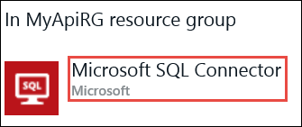

6.  Click **Poll Data (JSON)**.

    

7.  Enter **Frequency** and **Interval** with the following values. Click the green check box.
    <table class="tableizer-table">
        <tr><td>Frequency:</td><td>Minutes</td></tr>
        <tr><td>Interval:</td><td>1</td></tr>
    </table>

    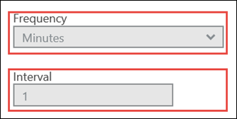

8. Click **Twilio Connector** listed in the **API Apps** pane under **Recommended Apps**.
    
    

9. Enter **Account SID** and **Auth Token** of your Twilio subscription. Clikc green check mark.
     
    `Note: No-charge developer test credentials are availble. Visit this link for more information: https://www.twilio.com/docs/api/rest/test-credentials`

    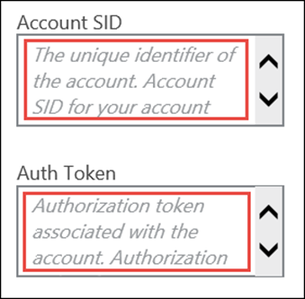

10. Click **Send Message**. 

    

11. Enter **From Phone Number** assigned by Twilio.

    

12. Enter **To Phone Number** where your messages will be sent.
    
    `Note: A test phone number is available without incurring charges. Visit this link for more information: https://www.twilio.com/docs/api/rest/test-credentials`

     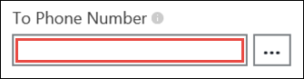

13. Enter the following in to **Text** for content of the messqage.

            @{first(triggers().outputs.body.Rows).FirstName}+@{first(triggers().outputs.body.Rows).LastName}+@{first(triggers().outputs.body.Rows).Phone}
        
14. Click **Save** from the toolbar at the top.

    

## Test the Logic App

In this task you will test the Logic App that was create in the last task.

1.  Click **Home** from the left navigation bar.

2.  Click **CRM SQL DATABASE** tile.
    
    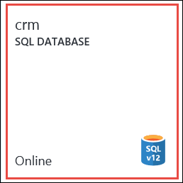

3. Click **Open in Visual Studio** from the top toolbar.

4. Open a **New Query**.

    
 
5. Paste and select the following statements and then click **Execute** button   to add customer records.

        INSERT INTO [Customer] ([LastName], [FirstName], [Phone], [Address], [City], [Processed]) VALUES (N'Stewart', N'Smith', N'555-555-5555', N'22 Spruce street', N'Orlando',N'false')
        INSERT INTO [Customer] ([LastName], [FirstName], [Phone], [Address], [City], [Processed]) VALUES (N'Orlando', N'Gee',N'555-555-5555', N'1001 Green street', N'New York',N'false')

6. Ensure two text messages arrive at the **To Phone Number** entered earlier in the **Twilio API Connector**.

##Summary

By completing this lab you have learned the basic concepts of Logic Apps in the Azure App Service.

